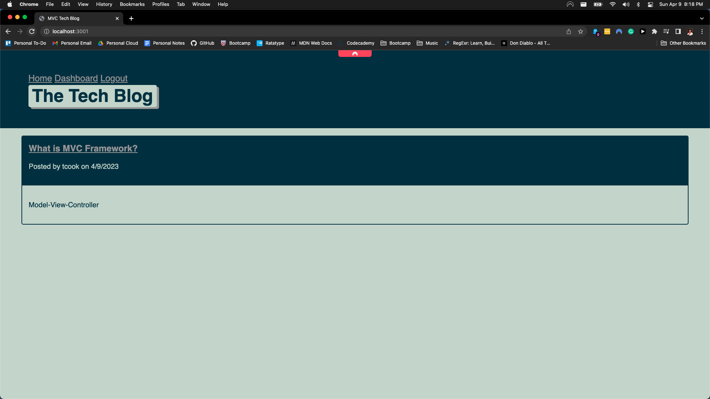
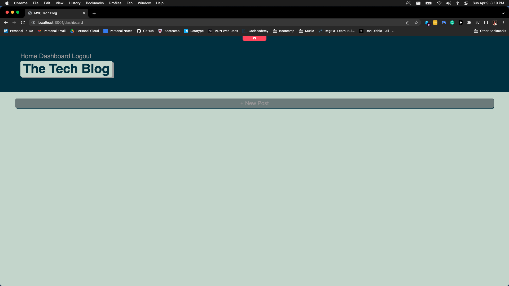

# Tech Blog MVC

Project Repo: [Github-repo](https://github.com/timothymichaelcook/14_tech_blog_mvc)

## Description

The focus of this project was to create an web application serving as a blog that allows a user to view and interact with elements such as a login page, signup page and blog post page. This challenge allows users to create their own blog posts,  edit, and comment on blog posts via the dashboard view. The home view will show all the created posts by a user.

## User Story

```
- AS A developer who writes about tech
- I WANT a CMS-style blog site
- SO THAT I can publish articles, blog posts, and my thoughts and opinions
```

## Installation 

Packages:
Dotenv
MySQL
Express
Handlebars
Sequelize
Bcrypt

Commands:
mysql -u root -p
source schema.sql
npm i
node seeds
node server.js

## Usage

Users need to import the following npm packages: express, mysql, bcrypt, handlebars and dotenv. Run npm i to install these packages. Users need to enter the database and source the schema file. Once seeded, the user needs to be in the root directory of the project and run node seeds as well as node server.js to start the application. At local host url port 3001, users will see the homepage where blog posts are.In order to create a blog post, user will need to user the sign up button to create an account and log into the account. Users will then have the option to create a blog post as well as edit older blog posts.

## Credits

University of Richmond Coding Bootcamp

## License

MIT License

## Screenshots REDO






## Contact

Timothy Cook - timothy.michael.cook@gmail.com
